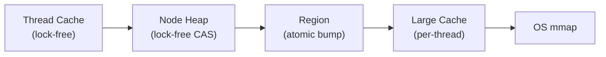
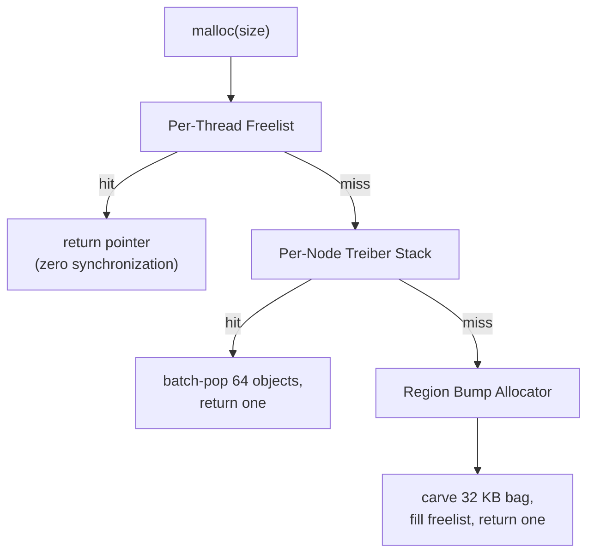
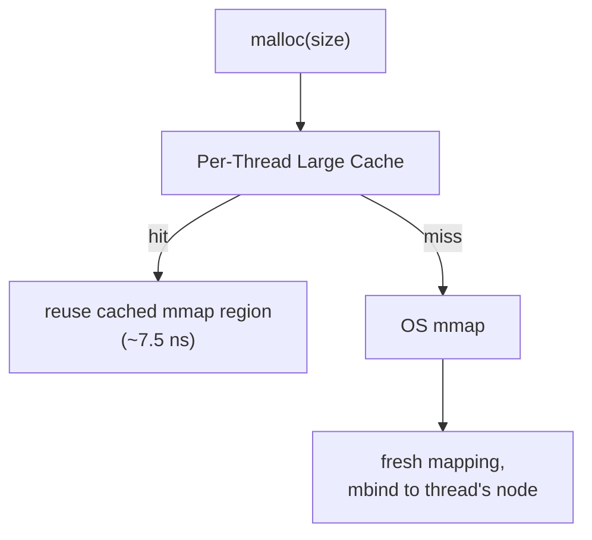
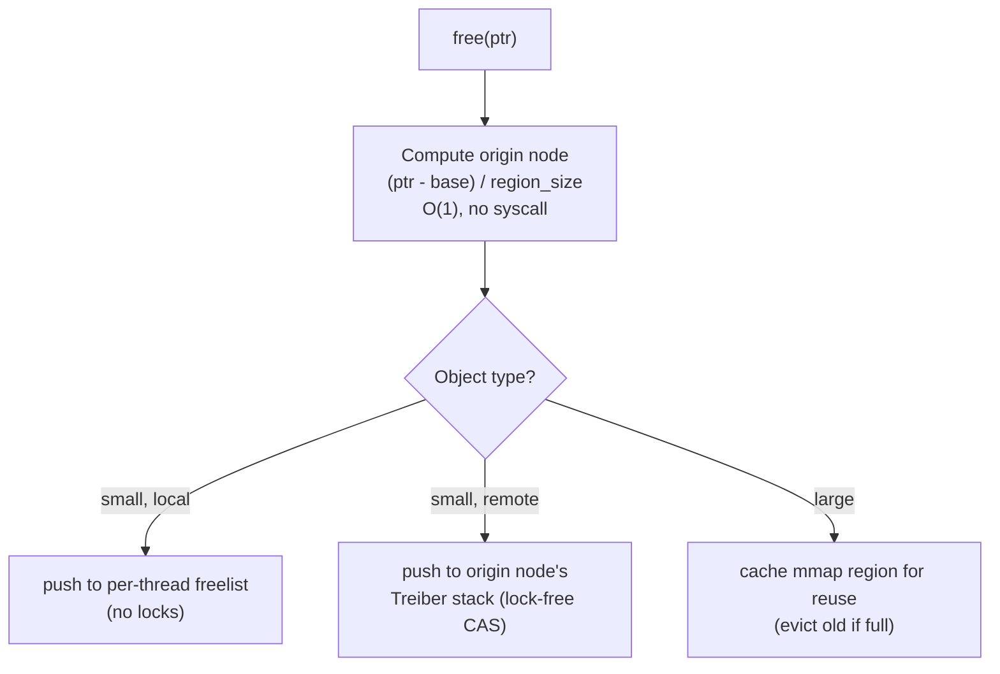
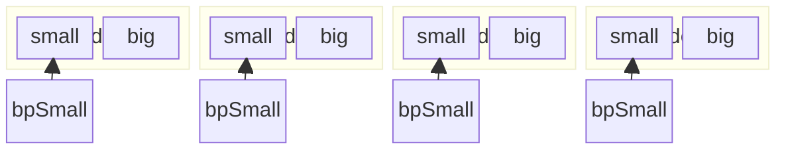

# NUMAlloc

**A blazing-fast, NUMA-aware memory allocator written in pure Rust.**

NUMAlloc is a drop-in replacement for the global allocator, purpose-built for Non-Uniform Memory Access (NUMA) machines. It pins threads and memory to NUMA nodes, routes freed objects back to their origin node, and shares huge pages incrementally -- delivering fewer remote memory accesses, fewer TLB misses, and lower latency than general-purpose allocators.

## Features

- **Zero-cost NUMA awareness** - O(1) origin-node lookup via pointer arithmetic, no syscalls on the hot path
- **Origin-aware deallocation** - freed objects return to their origin node's freelist, eliminating remote reuse
- **Lock-free concurrency** - Treiber stacks with ABA-safe generation tags for inter-thread communication
- **Incremental huge page sharing** - threads on the same node share 2 MB transparent huge pages in 32 KB increments
- **Memory safe** - built with Rust's ownership model; every `unsafe` block is documented with safety invariants
- **Minimal dependencies** - only `libc` for POSIX syscalls, no proc macros, no heavy frameworks
- **Drop-in `GlobalAlloc`** - one line to replace your allocator

## Quick Start

Add to your `Cargo.toml`:

```toml
[dependencies]
numalloc = "0.1"
```

Set as global allocator:

```rust
use numalloc::NumaAlloc;

#[global_allocator]
static ALLOC: NumaAlloc = NumaAlloc::new();

fn main() {
    // All allocations now go through NUMAlloc.
    let v: Vec<u64> = vec![1, 2, 3];
    println!("{v:?}");
}
```

## Architecture

NUMAlloc uses a five-layer allocation hierarchy, from fastest to slowest:



### Allocation path (small objects, <= 16 KB)



### Allocation path (large objects, > 16 KB)



### Deallocation path



### Heap layout

A single contiguous virtual region is mapped at init and divided equally among NUMA nodes. Each sub-region is bound to its physical node via `mbind`. This design enables origin-node identification through simple integer division on any pointer.



For the full design document with Mermaid diagrams and benchmark details, see [docs/architecture_design.md](docs/architecture_design.md).

## Benchmarks

Single-threaded alloc+dealloc (steady state, lower is better):

| Size   | numalloc   | system (glibc) | mimalloc | jemalloc |
|--------|------------|----------------|----------|----------|
| 8 B    | **7.4 ns** | 13.8 ns        | 10.9 ns  | 9.2 ns   |
| 64 B   | **7.4 ns** | 15.4 ns        | 11.1 ns  | 9.4 ns   |
| 1 KB   | **7.4 ns** | 31.2 ns        | 15.7 ns  | 9.8 ns   |
| 16 KB  | **7.3 ns** | 31.7 ns        | 19.3 ns  | 23.2 ns  |
| 64 KB  | **7.7 ns** | 692 ns         | 19.4 ns  | 104 ns   |
| 256 KB | **8.4 ns** | 707 ns         | 956 ns   | 105 ns   |

Multi-threaded alloc+dealloc (10,000 ops/thread, lower is better):

| Config          | numalloc   | system  | mimalloc | jemalloc |
|-----------------|------------|---------|----------|----------|
| 64 B, 4 threads | **152 us** | 1.1 ms  | 177 us   | 159 us   |
| 1 KB, 8 threads | **208 us** | 2.36 ms | 299 us   | 232 us   |
| 4 KB, 8 threads | **239 us** | 469 us  | 373 us   | 254 us   |

Run benchmarks yourself with `cargo bench`.

## Design Principles

- **Hot path = zero synchronization.** Per-thread freelists are single-owner, no atomics, no syscalls.
- **Lock-free over locks.** Shared per-node heaps use Treiber stacks with CAS, not mutexes.
- **Batch everything.** Drain and refill operations move 32 objects at once, amortizing CAS cost.
- **Intrusive data structures.** Free blocks store their `next` pointer in the freed memory itself -- zero extra overhead.
- **Explicit safety.** Every `unsafe` block carries a `// SAFETY:` comment. `NonNull<T>` over `*mut T`. `UnsafeCell` for interior mutability.

## When to Use NUMAlloc

**Good fit:**
- Multi-threaded server applications on NUMA hardware (2+ sockets)
- Workloads with many small allocations and high thread counts
- Environments with transparent huge pages enabled

**Not ideal for:**
- Single-threaded applications
- Heavy cross-node producer-consumer patterns
- Asymmetric or heterogeneous memory topologies

## Contributing

Contributions are welcome! Please ensure your changes pass:

```sh
cargo fmt
cargo clippy -- -D warnings
cargo test
```

## License

See [LICENSE](LICENSE) for details.

## References

Based on: Yang et al., *"NUMAlloc: A Faster NUMA Memory Allocator,"* ISMM 2023, ACM.
