# NUMAlloc: Architecture Design Document

## 1. Overview

NUMAlloc is a replacement memory allocator purpose-built for Non-Uniform Memory Access (NUMA) machines. It intercepts standard `malloc`/`free` calls via `LD_PRELOAD`, so applications need zero source-code changes. The allocator is built around three core ideas:

1. **Binding-based memory management** — threads and memory regions are pinned to NUMA nodes at startup.
2. **Origin-aware allocation and deallocation** — every heap object carries an implicit "origin node," and freed objects always return to their origin node's freelist.
3. **Incremental sharing of huge pages** — threads on the same node share transparent huge pages (THP) in small increments, combining TLB-miss reduction with low memory waste.

The result: 15.7% faster than mimalloc, 20.9% faster than glibc, with 9× fewer remote memory accesses and 18× fewer TLB misses on average across 25 benchmarks.

---

## 2. The Problem: Why NUMA Needs a Dedicated Allocator

### What is NUMA?

In a NUMA machine, each CPU socket (node) has its own local memory. Accessing local memory is fast; accessing another node's memory ("remote access") is 2–3× slower. A typical server might have 2–8 nodes, each with 16–32 cores.

### Why existing allocators fail on NUMA

Traditional allocators (glibc, TCMalloc, jemalloc, mimalloc) were designed for uniform memory. They cause four categories of NUMA performance problems:

| Problem                       | Root cause                                                                                         | Impact                                                    |
|-------------------------------|----------------------------------------------------------------------------------------------------|-----------------------------------------------------------|
| **Expensive node lookups**    | Checking which node a thread runs on requires a syscall (~10,000 cycles)                           | Allocators avoid checking, so they guess wrong            |
| **Blind deallocation**        | Freed objects go to the deallocating thread's cache regardless of which node the memory belongs to | Reuse of freed memory triggers remote accesses            |
| **Thread migration**          | The OS can move a thread to a different node mid-execution                                         | All of a thread's "local" memory becomes remote overnight |
| **No huge page coordination** | Allocators either ignore THP or give each thread a private 2MB superblock                          | Wasted memory or missed TLB optimization                  |

NUMAlloc tackles all four.

---

## 3. High-Level Architecture

The system is composed of four layers, from hardware up to the application:

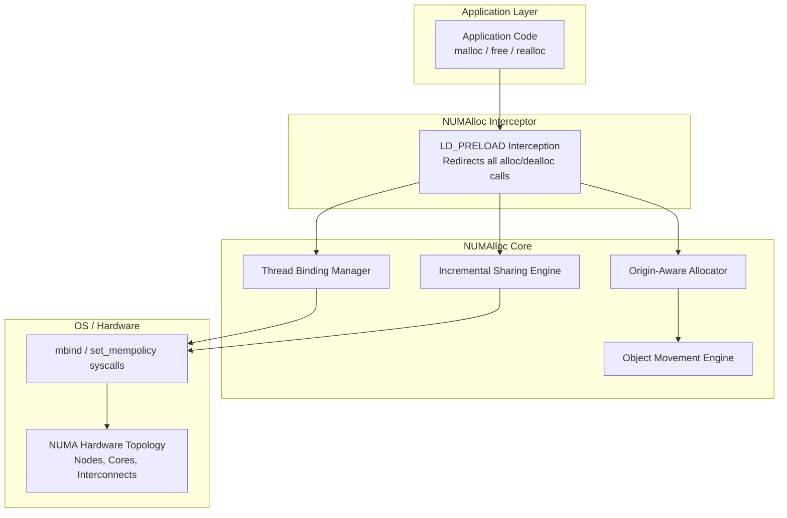

---

## 4. Heap Layout

NUMAlloc's heap is a single large contiguous virtual memory region, divided equally among all NUMA nodes. This layout is the foundation for every other design decision.

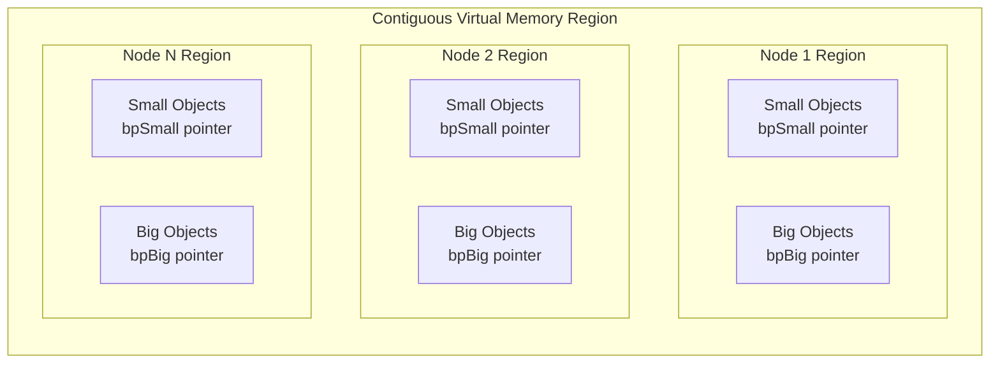

### Key properties

- **Each region is bound** to its corresponding physical node via the `mbind` syscall. Region 1 → Node 1, Region 2 → Node 2, etc.
- **Node lookup is a division**: given a pointer `p`, its origin node = `(p - heap_base) / region_size`. No syscall needed.
- **Small objects** (up to 256 KB) are managed in BiBOP-style bags (32 KB for objects up to 16 KB; larger classes use a bag equal to the object size), each holding objects of one size class.
- **Big objects** (> 256 KB) are backed by individual `mmap` regions with a per-thread large object cache to avoid repeated syscalls.

### Per-Thread and Per-Node Heaps

Each thread gets a private per-thread heap (no locks needed). Each node has a shared per-node heap (lock-protected, but accessed less frequently).

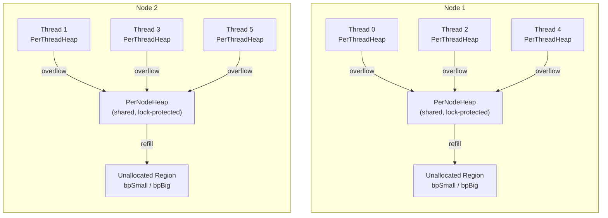

Each PerThreadHeap has one freelist per size class. When a per-thread freelist overflows (too many freed objects), it drains to the per-node heap. When it's empty, it refills from the per-node heap or from unallocated memory.

---

## 5. Core Component: Binding-Based Memory Management

### Thread Binding

At thread creation, NUMAlloc intercepts `pthread_create` and pins the new thread to a specific NUMA node (not a specific core — the OS can still schedule within the node).

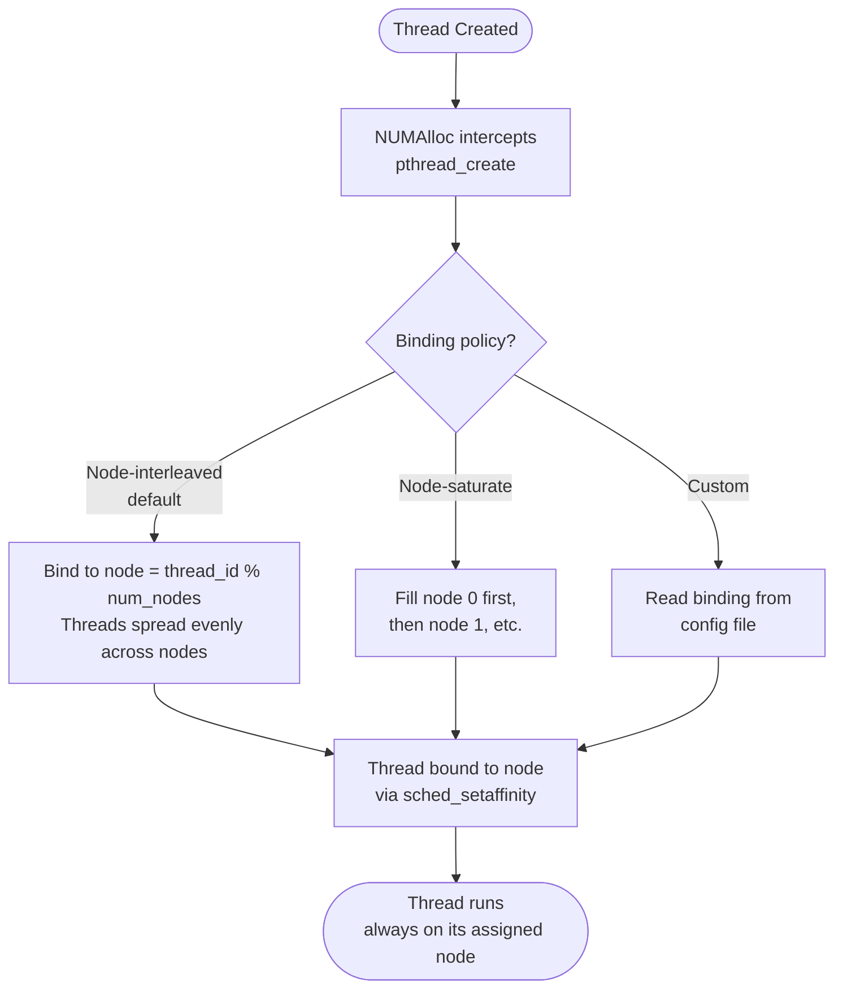

**Node-interleaved binding** (default): Thread 0 → Node 0, Thread 1 → Node 1, Thread 2 → Node 0, Thread 3 → Node 1, ... This distributes work evenly. Benchmarks show it's ~19% faster than node-saturate for full-core utilization.

**Node-saturate binding**: Fill one node completely before moving to the next. Better when using fewer cores than available.

### Benefits of binding

Once a thread is bound, NUMAlloc knows its node from a thread-local variable — no expensive `getcpu()` / `get_mempolicy()` syscalls. This knowledge powers everything else.

---

## 6. Core Component: Origin-Aware Memory Management

This is the mechanism that eliminates remote accesses during both allocation and deallocation.

### Allocation Path

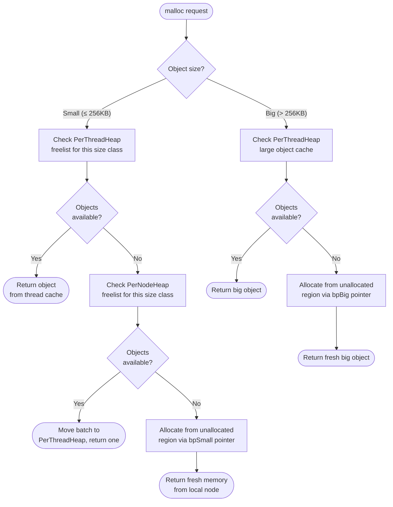

**Every step allocates from the current thread's node.** The per-thread freelist holds local objects. The per-node freelist holds local objects returned by origin-aware deallocation. The unallocated region is pre-bound to the local node.

### Deallocation Path (Origin-Aware)

This is what makes NUMAlloc unique. When `free(ptr)` is called, NUMAlloc computes the origin node of `ptr` and compares it to the calling thread's node.

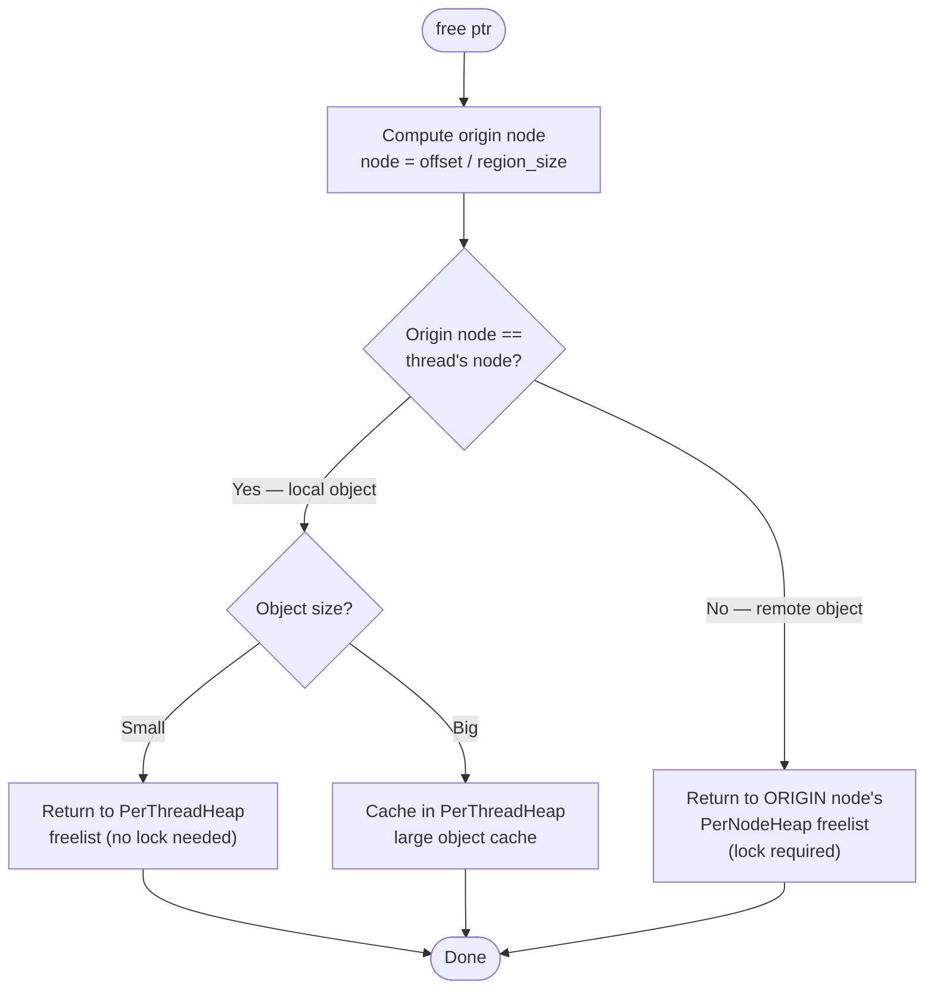

**Why this matters**: Traditional allocators put freed objects into the deallocating thread's cache. If Thread A (on Node 0) frees memory that was allocated on Node 1, the object stays in Thread A's cache. Next time Thread A reuses it, every access is a remote access. NUMAlloc avoids this by sending the object back to Node 1's freelist.

---

## 7. Core Component: Incremental Sharing of Huge Pages

Transparent Huge Pages (THP) reduce TLB misses by mapping 2 MB pages instead of 4 KB pages. But they cause memory waste: a single 8-byte allocation can consume 2 MB of physical memory.

### How NUMAlloc handles THP

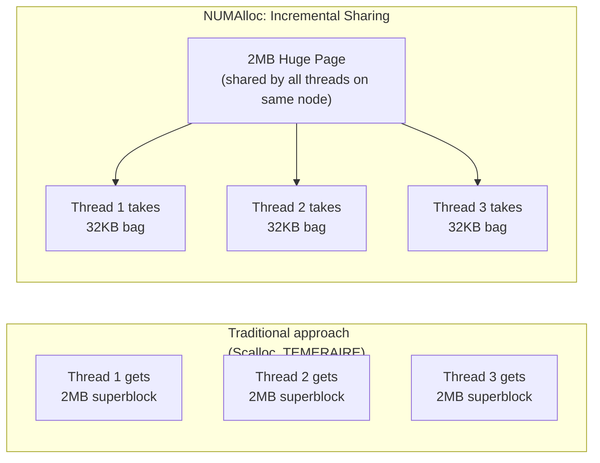

**Key rules:**

1. Threads on the **same node** share huge pages. This is safe because all accesses are local.
2. Each thread takes only **32 KB at a time** ("one bag"), not the full 2 MB.
3. Different size classes can share the same huge page, reducing fragmentation.
4. Metadata memory (e.g., `PerBagSizeInfo`, 8 bytes per bag) is explicitly allocated from normal 4 KB pages via `madvise`, preventing metadata from wasting huge-page space.

This gives NUMAlloc 4.5× less memory consumption than Scalloc and similar overhead to TCMalloc's TEMERAIRE, while still getting the TLB benefits.

---

## 8. Efficient Object Movement

Objects must move between per-thread and per-node freelists to prevent memory blowup (where one thread hoards freed memory that other threads need). NUMAlloc uses two data structures for this:

### Per-Thread Freelist: Tail + nth Pointer

When draining to the per-node heap, NUMAlloc moves the **least recently used** objects (between `nth` and `Tail`) in a single pointer swap — no traversal needed. This keeps hot objects in the thread cache and avoids polluting the CPU cache with cold data.

### Per-Node Freelist: Circular Array of Sub-Lists

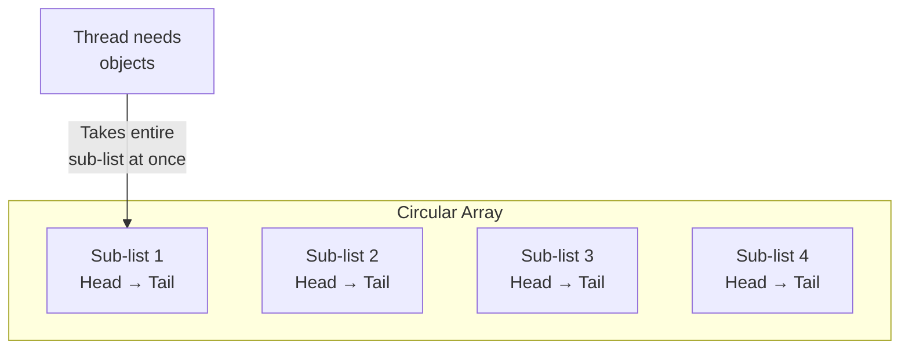

When a thread needs objects from the per-node heap, it grabs an **entire sub-list** (one Head–Tail pair) in a single lock-guarded operation. No traversal of the shared list, which minimizes lock contention when many threads compete.

---

## 9. Metadata Layout

NUMAlloc keeps all metadata local to the node that uses it:

| Metadata               | Location                                    | Size                                                   |
|------------------------|---------------------------------------------|--------------------------------------------------------|
| `PerBagSizeInfo`       | Separate area, normal pages (via `madvise`) | 8 bytes per bag (32 KB–256 KB depending on size class) |
| `PerBigObjectSizeInfo` | Linked list within each node's region       | Variable (size + availability per big object)          |
| `PerThreadHeap`        | Thread-local storage, on thread's node      | One freelist head per size class                       |
| `PerNodeHeap`          | Within each node's region                   | Freelists + circular array of sub-lists                |

Local metadata means that even metadata access is a local memory operation — no hidden remote accesses from bookkeeping.

---

## 10. Initialization Sequence

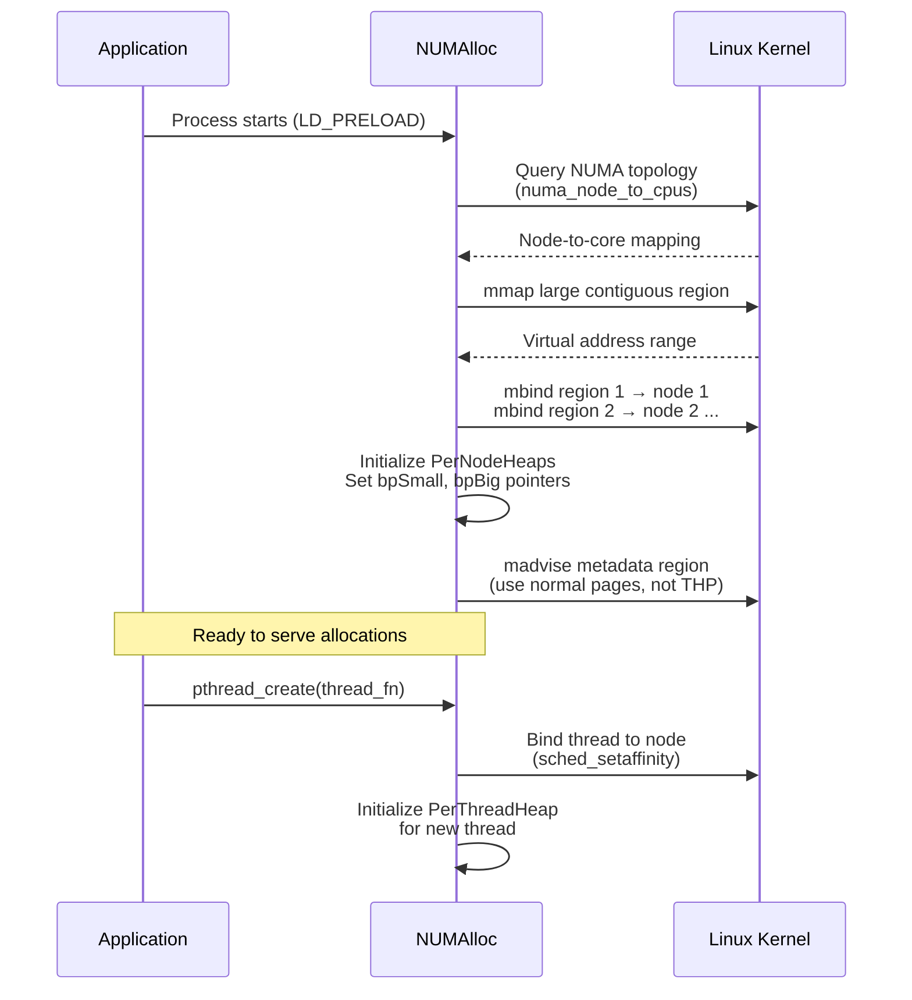

---

## 11. Large Object Cache

Objects larger than 256 KB bypass the bag-based small-object path and are backed by individual `mmap` regions. Without caching, every large alloc/dealloc pair incurs two syscalls (`mmap` + `munmap`), which costs 1--2 microseconds per pair.

### Architecture

The large object cache is a **per-thread, heap-allocated** structure that stores recently freed mmap regions for reuse. It is kept separate from `PerThreadHeap` so that the hot small-object freelists remain in a compact, cache-friendly struct (~320 bytes).

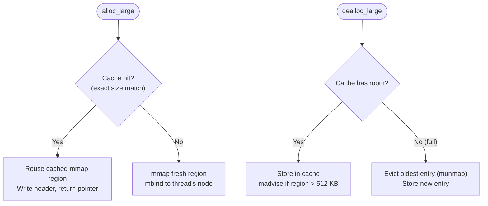

### Design Decisions

| Decision                          | Rationale                                                                                                                                                       |
|-----------------------------------|-----------------------------------------------------------------------------------------------------------------------------------------------------------------|
| **Heap-allocated cache**          | Keeps `PerThreadHeap` at ~320 bytes for L1-cache-friendly small-object access. The 16 KB cache array lives in a separate System-allocated block.                |
| **Exact size matching**           | The `alloc_size` (page-rounded total mmap size) is deterministic for a given `(size, align)` pair. Exact matching avoids wasting memory from oversized reuse.   |
| **Packed array with swap-remove** | Entries are stored contiguously from index 0..count. `take()` finds at index 0 (common case: all same size) and swap-removes in O(1). `put()` appends in O(1).  |
| **Eviction on full**              | When the cache is full, the oldest entries are evicted via `munmap` to make room. This allows the cache to adapt when allocation patterns change.               |
| **Conditional madvise**           | `madvise(MADV_FREE/MADV_DONTNEED)` is only called for regions > 512 KB. Below this threshold, the syscall overhead (~1 microsecond) exceeds the memory savings. |
| **1024 slots, 512 MiB limit**     | Handles bulk workloads (1000+ items) while bounding total virtual memory retained per thread.                                                                   |

### Impact

The large object cache eliminates syscall overhead for repeated large allocations. Combined with the extended size classes (up to 256 KB), objects that previously required individual `mmap` regions now go through the fast freelist path:

| Benchmark                  | Before (mmap)     | After             | Improvement |
|----------------------------|-------------------|-------------------|-------------|
| alloc_dealloc 64 KB        | 1.9 microseconds  | 7.7 ns            | **247x**    |
| alloc_dealloc 256 KB       | 2.15 microseconds | 8.4 ns            | **256x**    |
| bulk 1000x 64 KB           | 3.0 ms            | 57.2 microseconds | **52x**     |
| bulk 1000x 256 KB          | 3.94 ms           | 37.4 microseconds | **105x**    |
| page-aligned 64 KB (×100)  | 378 microseconds  | 2.7 microseconds  | **140x**    |
| realloc 4 KB to 64 KB      | 2.38 microseconds | 78 ns             | **31x**     |

---

## 12. Performance Results

### Micro-benchmarks (single-threaded alloc+dealloc, steady state)

| Size   | numalloc     | system (glibc) | mimalloc  | jemalloc  |
|--------|--------------|----------------|-----------|-----------|
| 8 B    | 6.5 ns       | 5.4 ns         | 5.2 ns    | **3.1 ns** |
| 64 B   | 7.0 ns       | 5.9 ns         | 5.4 ns    | **3.2 ns** |
| 256 B  | 6.9 ns       | 5.8 ns         | 6.1 ns    | **3.3 ns** |
| 1 KB   | 7.0 ns       | 5.9 ns         | 6.8 ns    | **3.6 ns** |
| 4 KB   | 6.6 ns       | 27.7 ns        | 10.4 ns   | **4.4 ns** |
| 16 KB  | **6.9 ns**   | 28.0 ns        | 10.3 ns   | 11.9 ns    |
| 64 KB  | **6.0 ns**   | 27.5 ns        | 10.2 ns   | 103.5 ns   |
| 256 KB | **5.9 ns**   | 27.0 ns        | 682.6 ns  | 104.2 ns   |

numalloc has the flattest profile of all tested allocators, maintaining ~6–7 ns from 8 B through 256 KB thanks to the per-thread freelist (small) and large object cache (large). It is the fastest allocator for objects ≥ 16 KB.

### Multi-threaded alloc+dealloc (10,000 ops/thread)

| Config          | numalloc         | system           | mimalloc         | jemalloc             |
|-----------------|------------------|------------------|------------------|----------------------|
| 64 B, 2 threads | 201 microseconds | 124 microseconds | 124 microseconds | **114 microseconds** |
| 64 B, 4 threads | 247 microseconds | 171 microseconds | **168 microseconds** | 169 microseconds |
| 1 KB, 8 threads | 277 microseconds | **251 microseconds** | 287 microseconds | 270 microseconds |
| 4 KB, 2 threads | 143 microseconds | 297 microseconds | 181 microseconds | **132 microseconds** |
| 4 KB, 8 threads | **276 microseconds** | 489 microseconds | 345 microseconds | 284 microseconds |

numalloc scales well for larger objects at high thread counts due to its lock-free per-node Treiber stacks and zero-synchronization per-thread freelists. On non-NUMA hardware the NUMA binding overhead is visible for small objects; on NUMA machines the locality gains dominate.

### Bulk alloc+free (1000 items, single-threaded)

| Size   | numalloc              | system            | mimalloc              | jemalloc          |
|--------|-----------------------|-------------------|-----------------------|-------------------|
| 64 B   | 6.1 microseconds      | 24.7 microseconds | **3.9 microseconds**  | 8.3 microseconds  |
| 4 KB   | 26.6 microseconds     | 574 microseconds  | **25.5 microseconds** | 105 microseconds  |
| 64 KB  | **30.8 microseconds** | 835 microseconds  | 52.5 microseconds     | 220 microseconds  |
| 256 KB | **15.4 microseconds** | 1.09 ms           | 123 microseconds      | 218 microseconds  |

### Axum HTTP server benchmark (4 threads, 100 connections, 10s)

Tested on Ubuntu, Intel Core i7-13700K, 64 GB RAM.

| Endpoint         | numalloc          | system         | mimalloc          |
|------------------|-------------------|----------------|-------------------|
| `/small` ~32 B   | **759,327 rps**   | 722,577 rps    | 739,654 rps       |
| `/medium` ~256 B | **733,566 rps**   | 705,512 rps    | 717,661 rps       |
| `/large` ~16 KB  | 343,262 rps       | 299,309 rps    | **357,168 rps**   |
| `/bulk` ~64 KB   | 110,965 rps       | 93,805 rps     | **113,273 rps**   |

| Allocator | RSS after load |
|-----------|----------------|
| system    | **15 MB**      |
| numalloc  | 20 MB          |
| mimalloc  | 37 MB          |

numalloc leads on small/medium response sizes where allocation overhead dominates. For large responses the allocator difference is dwarfed by serialization and I/O costs, where mimalloc edges ahead. numalloc uses 46% less RSS than mimalloc.

### NUMA-specific results (8-node Intel Xeon, 128 cores)

| Metric                     | NUMAlloc vs. glibc | NUMAlloc vs. mimalloc |
|----------------------------|--------------------|-----------------------|
| Average speedup            | 20.9% faster       | 15.7% faster          |
| Best case (fluidanimate)   | 5.3x faster        | 4.6x faster           |
| Remote accesses            | 9x fewer           | 8x fewer              |
| TLB misses                 | 18x fewer          | --                    |
| Scalability at 128 threads | 88x speedup        | 75x (mimalloc)        |

---

## 13. Limitations and Trade-offs

1. **Higher memory consumption with THP enabled** — The large initial `mmap` triggers huge-page backing. NUMAlloc uses 17.6% more memory than glibc (but 4.5× less than Scalloc). Could be improved with TEMERAIRE-style page management.

2. **Thread binding is mandatory** — NUMAlloc pins threads to nodes. This doesn't conflict with OS scheduling (threads can still move between cores within a node), but it does prevent cross-node migration. For server workloads with thread pools, the node-interleaved binding works well.

3. **Remote deallocation bottleneck** — When many threads free objects originating from the same remote node, the per-node freelist lock can become contended. This is visible in the `larson` benchmark where mimalloc edges ahead at 128 threads.

4. **No support for heterogeneous memory** — NUMAlloc assumes all nodes have equal memory capacity and divides the heap evenly.

---

## 14. Comparison with Other Allocators

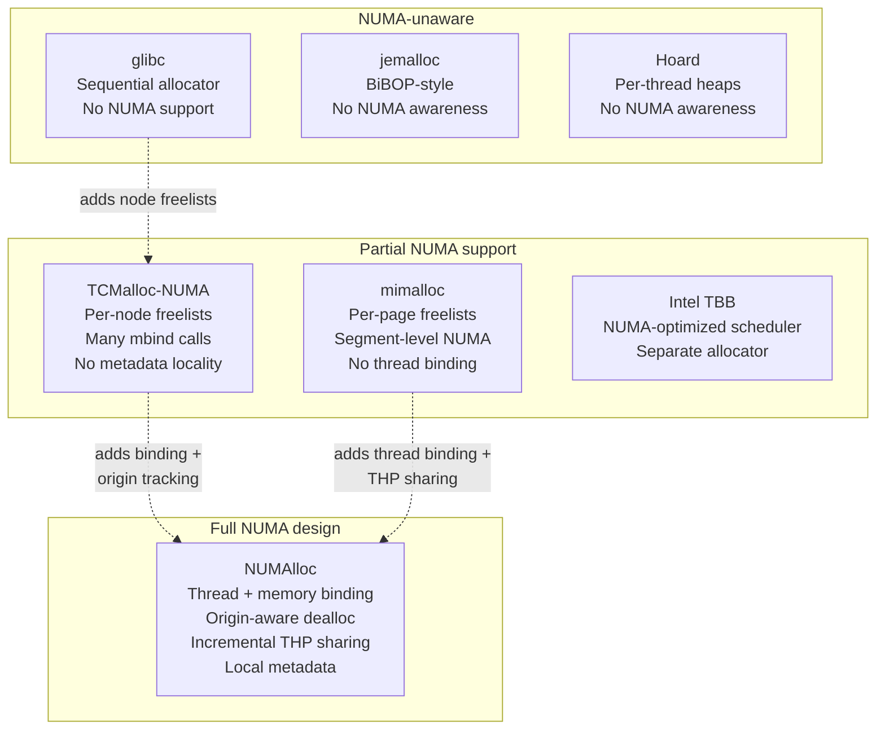

---

## 15. When to Use NUMAlloc

**Good fit:**
- Multi-threaded server applications on NUMA hardware (2+ sockets)
- Applications with many small allocations and high thread counts
- Workloads where threads primarily use their own allocated memory
- Environments where THP is enabled

**Poor fit:**
- Single-threaded applications (no NUMA benefit)
- Applications that intentionally share objects across threads on different nodes (producer-consumer across sockets)
- Systems with asymmetric NUMA topologies or heterogeneous memory

---

*Based on: Yang et al., "NUMAlloc: A Faster NUMA Memory Allocator," ISMM 2023, ACM.*